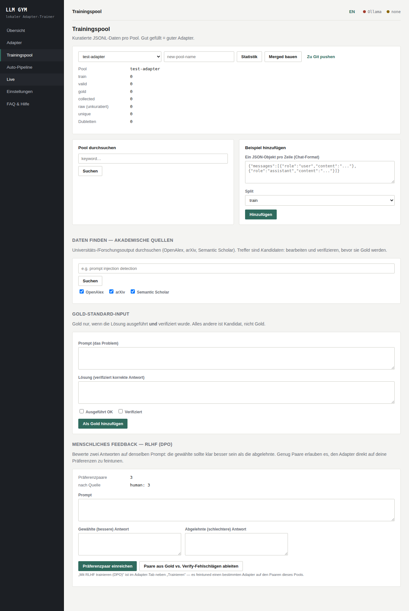
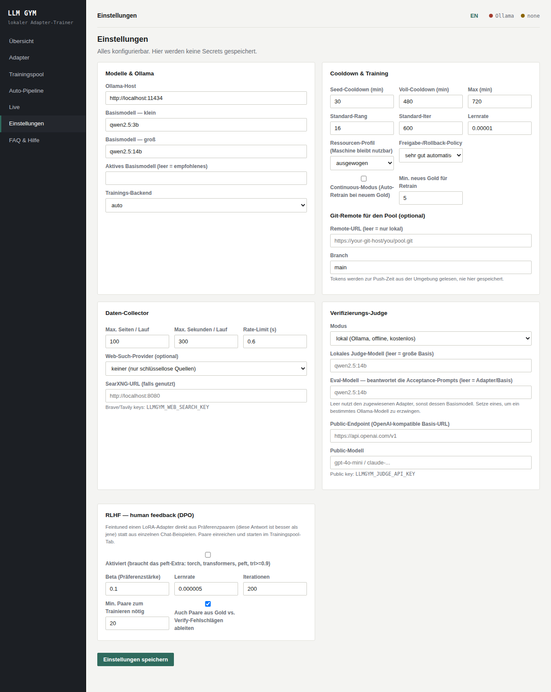
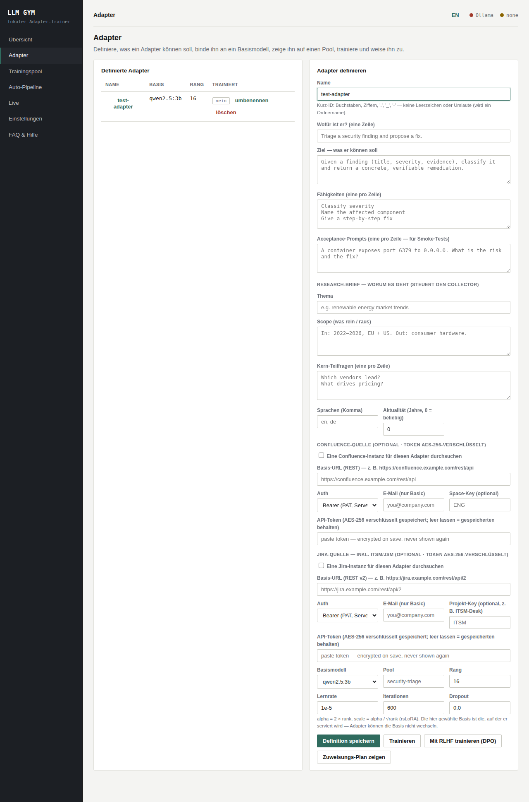
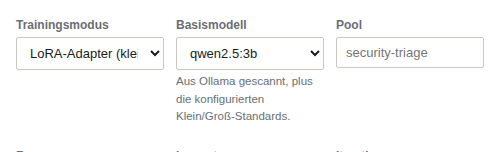
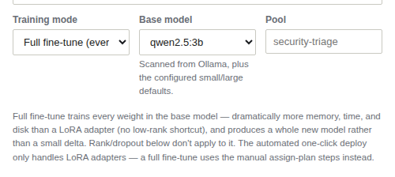

# LLM Gym

You want a local model that's actually good at *your* one specific job — triage
your tickets, answer in your product's vocabulary, follow your team's format —
without sending your data to a cloud API and without the cost, risk, and GPU
cluster that "just fine-tune the model" usually implies.

**LLM Gym is a small, self-hostable dashboard that does exactly that.** It trains
and serves **LoRA adapters** — tiny, swappable skill modules — on top of a local
LLM. You describe what the adapter should do, drop in some example data, click
train, and point your app at the result through [Ollama](https://ollama.com).
It runs on a laptop. No cluster, no account, no cloud service, and every step
happens in the browser.

```
 define adapter ──▶ training pool ──▶ [ single queue ] ──▶ train (MLX | PEFT) ──▶ assign to Ollama
   (what + base)     (JSONL + gold)    one job at a time     LoRA on the base       served model
```


*The demo above (~1 minute): define a small "security-triage" adapter, add a
handful of examples to its pool, train it, and watch it land in the queue —
end to end, in the actual app, in simulate mode (no GPU needed to try it).*

## Why adapters, not full fine-tunes

Training a full model is expensive, easy to break, and gives you one monolith.
A **LoRA adapter** is a tiny set of extra weights (often a few MB) trained on top
of a frozen base model. You get:

- **Cheap, fast iterations** — minutes on a laptop GPU, not hours on a cluster.
- **One base, many skills** — keep the base model, swap adapters per task.
- **Reversible** — a bad adapter is deleted, the base is untouched.
- **Specific** — an adapter is shaped by *your* curated data for *one* job.

An adapter is bound to the exact base it was trained on (train on `qwen2.5:3b`,
serve on `qwen2.5:3b`). The gym records this and only offers matching pairings.

Sometimes you do want every weight to move — a small base model picking up a
domain LoRA can't reach. The gym supports that too as an explicit choice per
adapter rather than a separate workflow: see
[Training mode — LoRA or full fine-tune](#training-mode--lora-or-full-fine-tune)
below.

## Features

- **System check** — detects your OS/GPU/memory and recommends a base model size.
- **Ollama integration** — list, pull, and (after fuse) create models.
- **Single training queue** — one adapter trains at a time. No overlap, no OOM.
- **Cooldown calculator** — decides when a lane may train again; staggers the queue.
- **Adaptive early-stop** — caps iterations for lanes that overfit.
- **Adapter definitions** — declare name, objective, capabilities, base, and pool.
- **Training pool** — local JSONL with dedup, train/valid split, and a **gold**
  tier; optional push to any Git remote.
- **Academic search** — pull candidate data from OpenAlex, arXiv and Semantic
  Scholar (university / research output).
- **Pluggable backends** — MLX on Apple Silicon, PyTorch/PEFT on NVIDIA/CPU, and
  a **simulate** fallback so the whole flow works with no GPU at all.
- **No guessing** — when no backend is installed the dashboard prints the exact
  install command for *your* machine, and a built-in **FAQ & help** tab explains
  every step in plain language.
- **Data collector** — point it at an adapter; it derives queries from the
  adapter's objective, gathers candidates from open sources (and an optional web
  provider), scrubs PII, and scores each into a tier: **Platin / Gold / Silver /
  Bronze**. It respects robots.txt and stops at a page/time budget.
- **Pool analysis + forecast** — before training, see the tier mix, duplicate
  ratio, capability coverage and a heuristic outcome estimate, all visualised.
- **Auto-pipeline** — one click runs: collect → analyse → *(you pick the tier)* →
  train → check → verify → cooldown → *(you decide promote)*. Two human gates,
  everything else automatic. Resumable training checkpoints; a per-adapter
  cooldown is computed, stored and enforced.
- **Verification judge** — runs the adapter on its acceptance prompts and grades
  the answers against its objective. Local Ollama judge by default; an optional
  public AI (any OpenAI-compatible endpoint) can be switched on, key from the
  environment at runtime.
- **RLHF (human feedback)** — rate two answers to the same prompt as a
  preference pair, then fine-tune a LoRA adapter directly on those pairs with
  DPO. Pairs also auto-derive for free from data the gym already collects
  during verification (gold answer vs. a same-prompt verify failure). See
  [RLHF — fine-tune from human feedback](#rlhf--fine-tune-from-human-feedback)
  below.
- **Training mode: LoRA or full fine-tune** — per adapter, train a LoRA delta
  (default) or fine-tune every weight in the base model. The base-model picker
  scans your local Ollama instance live, so you pick from what's actually
  installed instead of typing a tag from memory. See
  [Training mode — LoRA or full fine-tune](#training-mode--lora-or-full-fine-tune)
  below.
- **Phone terminal** — a token-protected web terminal served from the laptop:
  open one URL on your phone and drive a real shell (tmux-backed, so it
  survives disconnects) to check on runs from the couch. See
  [`docs/PHONE_TERMINAL.md`](docs/PHONE_TERMINAL.md).

## RLHF — fine-tune from human feedback

Training pool data (chat examples, gold pairs) teaches an adapter *what* to
answer. RLHF teaches it *which of two answers you'd rather have* — a much
cheaper signal to give than writing a full gold answer, and it directly
targets the mistakes an adapter is actually making.

The loop:

1. **Rate a pair.** On the **Training pool** tab, write a prompt and paste in
   two candidate answers — the one you'd keep (*chosen*) and the one you
   wouldn't (*rejected*). One click records the preference pair.
2. **Or skip the typing.** Hit **Derive pairs from gold vs. verify failures**
   and the gym builds pairs automatically from data it already has: a
   verified gold answer paired against a same-prompt answer that failed the
   verification judge.
3. **Train.** Once a pool has enough pairs (20 by default, tunable in
   **Settings**, along with the **Enable RLHF (DPO) training** switch itself —
   off by default), hit **Train with RLHF (DPO)** on the **Adapters** tab — it
   runs through the same single-worker queue as regular training, fine-tuning
   the adapter directly on your preferences via
   [Direct Preference Optimization](https://arxiv.org/abs/2305.18290).

| Rate preference pairs (Training pool) | Configure DPO (Settings) | Train with RLHF (Adapters) |
|---|---|---|
|  |  |  |

RLHF needs the same NVIDIA/CPU backend as regular training (`pip install
"llm-gym[peft]"`, `trl>=0.9` specifically — it ships `DPOTrainer`). Without it
installed, **Train with RLHF (DPO)** queues the job and fails with a clear
message instead of a stack trace; everything else in the gym still works.

RLHF respects the adapter's **Training mode** too (see below): LoRA DPO
produces a standard LoRA adapter — same `assign` / `deploy` flow as regular
training — while full-mode DPO fine-tunes every weight directly, same
tradeoffs and manual-deploy path as full-mode SFT.

Iterations are capped to what the pool's pair count can actually support
(same anti-overtraining logic as regular training), plus a hard ceiling,
since a training job can't be cancelled once it's running on the single
worker.

## Training mode — LoRA or full fine-tune

Every adapter definition has a **Training mode**: **LoRA adapter** (default) or
**Full fine-tune**. It's the same adapter concept end to end — one definition,
one training pool, one queue — with a single toggle deciding how much of the
base model actually moves:

- **LoRA adapter** — trains a small low-rank delta on top of a frozen base.
  Cheap, fast, reversible; see [Why adapters, not full
  fine-tunes](#why-adapters-not-full-fine-tunes) above.
- **Full fine-tune** — trains every weight in the base model directly (no
  `get_peft_model`/LoRA wrapping at all). Needs dramatically more memory, time,
  and disk than LoRA — expect this to OOM on hardware that trains LoRA fine.
  Rank/scale/dropout don't apply to it.

The **Base model** picker next to it scans your local Ollama instance
(`/api/ollama/models`) live and merges the result with the two configured
small/large defaults, so the dropdown reflects what's actually installed
rather than a hand-typed tag.

| LoRA adapter (default) | Full fine-tune |
|---|---|
|  |  |

A few things work differently once `full` is selected:

- **Backends.** PEFT (NVIDIA/CPU) trains `AutoModelForCausalLM` directly and
  saves a real HF checkpoint (`model.safetensors`, sharded for larger models)
  instead of an adapter delta. MLX (Apple Silicon) passes `fine_tune_type:
  full` straight through to `mlx_lm lora` — this path is **best-effort**: it
  has not been exercised against real Apple Silicon hardware, since none was
  available while building it. Watch a first run closely.
- **Deploy.** The automated one-click deploy (fuse → GGUF → quantize →
  `ollama create`) only handles LoRA adapters — there's no adapter to fuse
  once training already produced a complete model. A full fine-tune gets a
  manual plan instead (**Show assign plan** skips straight to GGUF
  conversion) rather than guessing at an untested fuse path.
- **Disk.** Full-fine-tune checkpoints are full-model sized, not a few MB
  delta. The queue refuses to start a full-mode job when free disk is too low
  instead of discovering it mid-run, and intermediate checkpoints are bounded
  so a long run can't slowly fill the disk.

## Requirements

- Python 3.10+
- [Ollama](https://ollama.com) for serving (optional during training)
- A training backend (optional — without one the gym runs in **simulate** mode):
  - Apple Silicon: `pip install "mlx-lm>=0.18"`
  - NVIDIA / CPU: `pip install "torch>=2.2" "transformers>=4.40" "peft>=0.10" "datasets>=2.18" "trl>=0.9"`
    (`trl>=0.9` is required for RLHF/DPO training specifically — the SFT path works with older trl too)

## Install & run

```bash
git clone <your-fork-url> llm-gym
cd llm-gym
python -m venv .venv && source .venv/bin/activate    # Windows: .venv\Scripts\activate
pip install -r requirements.txt
python -m llm_gym                                    # -> http://127.0.0.1:8000
```

Open the URL, go to **Dashboard**, and the system check tells you which base
model to pull. Pull it from the dashboard (or `ollama pull qwen2.5:3b`), define
an adapter on the **Adapters** tab, fill a pool on the **Training pool** tab, and
hit **Train**.

### Control the laptop from your phone

Long runs don't need you at the desk. `./run.sh terminal` (or
`python -m llm_gym.terminal`) starts a token-protected web terminal and prints
a URL — open it on your phone (same Wi-Fi) for a full shell in the mobile
browser, tmux-backed so the session survives locks and Wi-Fi blips. For use
away from home, front it with a TLS tunnel and a real domain
(`--domain laptop.tail1234.ts.net` + `tailscale serve`, or your own domain via
cloudflared). Details, domain recipes, and the security model:
[`docs/PHONE_TERMINAL.md`](docs/PHONE_TERMINAL.md).

## Configuration

Everything is editable from the **Settings** tab and persisted to `settings.json`
(gitignored). You can also set defaults via environment variables — copy
`.env.example` to `.env`. Nothing here is secret by design; an optional Git push
token is read from the environment at push time and never stored.

Key settings: Ollama host, the small/large base models, the active base, the
training backend (`auto|mlx|peft`), cooldown minutes, LoRA defaults, and an
optional Git remote for the pool.

## The training pool

A pool is a folder of chat-format JSONL under `data/pool/<name>/`:

```jsonl
{"messages":[{"role":"user","content":"..."},{"role":"assistant","content":"..."}],
 "_meta":{"source":"...","verified":false,"quality_score":70}}
```

- `train.jsonl` / `valid.jsonl` — your curated split.
- `gold.jsonl` — verified gold pairs (highest trust). A pair is **gold** only when
  the solution was *executed* **and** *verified*.
- `raw/` — anything you dumped in but have not curated yet (e.g. academic candidates).
- `merged.jsonl` — built on demand: a deduplicated union of gold + train with
  cross-split leakage removed. This is what training consumes.

See [`examples/adapter-spec.md`](examples/adapter-spec.md) for the adapter format,
[`docs/USAGE.md`](docs/USAGE.md) for the end-to-end workflow, and
[`docs/FAQ.md`](docs/FAQ.md) for quick answers (same content as the app's own
**FAQ & help** tab).

## Assigning an adapter

After training, open **Show assign plan**. For serving through Ollama you fuse
the adapter into the base, convert to GGUF, and `ollama create` a model your app
calls by name. The plan prints the exact commands for your backend. Or keep it as
an adapter and attach it at inference via `--adapter-path` on the matching base.

## Project layout

```
llm_gym/
  app.py            FastAPI app + JSON API
  config.py         settings (env + settings.json)
  system_check.py   hardware detection + model recommendation
  ollama_client.py  Ollama REST client
  pool.py           training pool (JSONL, dedup, split, search, git push)
  academic.py       OpenAlex / arXiv / Semantic Scholar search
  gold.py           gold-standard entry rules
  cooldown.py       cooldown + adaptive early-stop (pure functions)
  queue.py          the single training queue (SQLite, one worker)
  adapters.py       adapter definitions
  deploy.py         assign adapter -> Ollama
  trainer/          pluggable backends: mlx, peft, simulate
  static/           the UI (no build step)
examples/           ready-to-edit adapter specs
docs/USAGE.md       the full walkthrough
docs/FAQ.md         quick answers (mirrors the app's FAQ & help tab)
```

## License

MIT — see [LICENSE](LICENSE).
